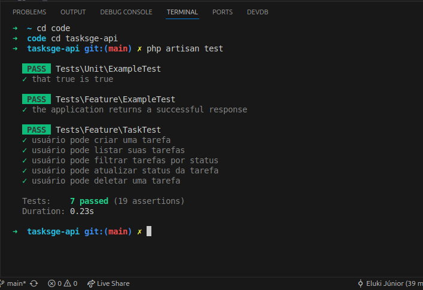

# 📌 API de Gerenciamento de Tarefas (To-Do List)

Uma API RESTful construída em Laravel para gerenciamento de tarefas com autenticação via Sanctum. Cada usuário pode criar, listar, filtrar, atualizar e deletar suas próprias tarefas.

---

## ⚙️ Requisitos

- PHP >= 8.1
- Composer
- MySQL ou SQLite
- Laravel >= 12.x
- Node.js (opcional, apenas se usar frontend)
- [Postman](https://www.postman.com/) ou `curl` para testar

--- 

## 🚀 Como configurar o projeto

```bash
git clone https://github.com/Kimossii/tasksge-api.git
cd seu-repo
composer install
cp .env.example .env
php artisan key:generate
```
---
## 🛠️ Rodar migrations 
* No terminarl aonde tiver locazido o projecto
```bash

php artisan migrate
php artisan serve
```
Servidor geralemente roda em: http://localhost:8000


## 🧪 Testar a API
 * 🔑 Obter Token Sanctum
Faça o login (ou registre um novo usuário) e use o token para autenticação:
```bash
POST /api/auth/login

```
## 📫 Endpoints principais

### 🔐 Autenticação
#### 1. Registrar usuário 
* POST /api/auth/register
##### Exemplo:
```bash
{
  "name":"Eluki",
  "email":"eluki@email.com",
  "password":"senha123",
"password_confirmation":"senha123"
}
```
#### 2. Login e obter token
* POST /api/auth/login
```bash
{
  "email": "joao@email.com",
  "password": "senha123"
}
```
##### A resposta trará o token que você deve usar como Bearer Token nos headers de autenticação: Authorization: Bearer SEU_TOKEN_AQUI

#### 3. Logout
* POST /api/auth/logout

### 📘 Endpoints de Tarefas

#### Criar Tarefa
* POST /api/tasks/store 
```bash
{
  "title": "Tarefa exemplo",
  "description": "Descrição opcional"
}
Response 201:
{
  "id": 1,
  "user_id": 1,
  "title": "Tarefa exemplo",
  "description": "Descrição opcional",
  "status": "pendente",
  "created_at": "...",
  "updated_at": "..."
}


```

#### Listar todas as tarefas do usuário
* GET /api/tasks/list — Listar 
#### Filtrar por status
* GET /api/tasks/filter/{status} 
##### Filtrar por estatos: pendente; em andamento e conluída 
#### Atualizar status
PUT /api/tasks/status/{status}
```bash
{
  "status": "concluída"
}
```
##### Os estatos são: pendente; em andamento e conluída

#### Deletar tarefa
DELETE /api/tasks/delete/{id} 

## ✅ Rodar testes
```bash
php artisan test
```


#### 🧪 Testes incluídos
* Criar tarefa

* Listar tarefas

* Filtrar por status

* Atualizar status

* Deletar tarefa
